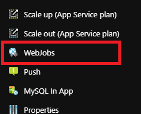
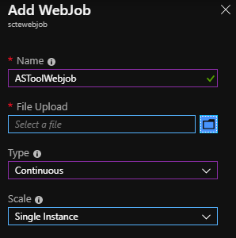

# What is ASTOOL?
Adaptive Streaming Tool is an application supporting several features related to Adaptive Streaming. The first version is specifically dedicated to Smooth Streaming.
For instance, with ASTool version 1.0 you can
- Push a Smooth Streaming towards a Live Smooth  Streaming Ingestion Point in order to emulate a Live TV channel,
- Pull a Smooth Streaming asset (Live or VOD) from an existing service towards ismv and isma file on the local disk,
- Pull and Push a Live Smooth Streaming channel towards another Live Smooth Streaming Ingestion Point
- Parse isma and ismv files

As ASTool is based on .Net Core, the application can be installed on any operating system supporting .Net Core (Windows, Mac OS, Ubuntu, Debian, Centos, Red Hat).

The latest releases are available [here](https://github.com/flecoqui/ASTool/tree/master/Releases)

- [Windows latest release](https://github.com/flecoqui/ASTool/raw/master/Releases/LatestRelease.win.zip) 

    [win-download]:                 https://github.com/flecoqui/ASTool/raw/master/Releases/LatestRelease.win.zip
    [astool-version-badge]:            https://cdn.rawgit.com/flecoqui/ASTool/master/Docs/astoolbuild.svg
    [![Github Release][astool-version-badge]][win-download]

- [Linux (Ubuntu, Centos, Debian,...)  latest release](https://github.com/flecoqui/ASTool/raw/master/Releases/LatestRelease.linux.tar.gz)

    [linux-download]:                 https://github.com/flecoqui/ASTool/raw/master/Releases/LatestRelease.linux.tar.gz
    [astool-version-badge]:            https://cdn.rawgit.com/flecoqui/ASTool/master/Docs/astoolbuild.svg
    [![Github Release][astool-version-badge]][linux-download]

- [Linux (Lightweight distributions using musl like Alpine Linux) latest release](https://github.com/flecoqui/ASTool/raw/master/Releases/LatestRelease.linux-musl.tar.gz)

    [linux-musl-download]:                 https://github.com/flecoqui/ASTool/raw/master/Releases/LatestRelease.linux-musl.tar.gz
    [astool-version-badge]:            https://cdn.rawgit.com/flecoqui/ASTool/master/Docs/astoolbuild.svg
    [![Github Release][astool-version-badge]][linux-musl-download]

- [Red Hat latest release](https://github.com/flecoqui/ASTool/raw/master/Releases/LatestRelease.rhel.tar.gz)

    [rhel-download]:                 https://github.com/flecoqui/ASTool/raw/master/Releases/LatestRelease.rhel.tar.gz
    [astool-version-badge]:            https://cdn.rawgit.com/flecoqui/ASTool/master/Docs/astoolbuild.svg
    [![Github Release][astool-version-badge]][rhel-download]

- [Mac OS latest release](https://github.com/flecoqui/ASTool/raw/master/Releases/LatestRelease.osx.tar.gz)

    [osx-download]:                 https://github.com/flecoqui/ASTool/raw/master/Releases/LatestRelease.osx.tar.gz
    [astool-version-badge]:            https://cdn.rawgit.com/flecoqui/ASTool/master/Docs/astoolbuild.svg
    [![Github Release][astool-version-badge]][osx-download]

# Required Software
|[Windows pre-requisites](https://docs.microsoft.com/en-us/dotnet/core/windows-prerequisites?tabs=netcore2x)| [Linux pre-requisites](https://docs.microsoft.com/en-us/dotnet/core/linux-prerequisites?tabs=netcore2x)|  [Mac OS pre-requisites](https://docs.microsoft.com/en-us/dotnet/core/macos-prerequisites?tabs=netcore2x)|
| :--- | :--- | :--- |
| .NET Core is supported on the following versions of Windows 7 SP1, Windows 8.1, Windows 10 (version 1607) or later versions, Windows Server 2008 R2 SP1, Windows Server 2012 SP1, Windows Server 2012 R2, Windows Server 2016 or later versions | The Linux pre-requisites depends on the Linux distribution. Click on the link above to get further information &nbsp; &nbsp; &nbsp; &nbsp; &nbsp; &nbsp; &nbsp; &nbsp; &nbsp; &nbsp; &nbsp;&nbsp; &nbsp; &nbsp; &nbsp; &nbsp; &nbsp; &nbsp; &nbsp; &nbsp; &nbsp; &nbsp;&nbsp; &nbsp; &nbsp; &nbsp; &nbsp; &nbsp; &nbsp; &nbsp; &nbsp; &nbsp; &nbsp;&nbsp; &nbsp; &nbsp; &nbsp; &nbsp; &nbsp; &nbsp; &nbsp; &nbsp; &nbsp; &nbsp;&nbsp; &nbsp; &nbsp; &nbsp; &nbsp; &nbsp; &nbsp; &nbsp; &nbsp; &nbsp; &nbsp; &nbsp; &nbsp; &nbsp; &nbsp;&nbsp; &nbsp; &nbsp; &nbsp; &nbsp; &nbsp; &nbsp; &nbsp; &nbsp;&nbsp; &nbsp; &nbsp; &nbsp; &nbsp; &nbsp;&nbsp; &nbsp; &nbsp; &nbsp; &nbsp; &nbsp; &nbsp; &nbsp; &nbsp;&nbsp; &nbsp; &nbsp; &nbsp; &nbsp; &nbsp;&nbsp; &nbsp; &nbsp; &nbsp; &nbsp; &nbsp; &nbsp; &nbsp; &nbsp;| .NET Core 2.x is supported on the following versions of macOS macOS 10.12 "Sierra" and later versions &nbsp; &nbsp; &nbsp; &nbsp; &nbsp; &nbsp; &nbsp; &nbsp; &nbsp; &nbsp; &nbsp;&nbsp; &nbsp; &nbsp; &nbsp; &nbsp; &nbsp; &nbsp; &nbsp; &nbsp; &nbsp; &nbsp;&nbsp; &nbsp; &nbsp; &nbsp; &nbsp; &nbsp; &nbsp; &nbsp; &nbsp; &nbsp; &nbsp;&nbsp; &nbsp; &nbsp; &nbsp; &nbsp; &nbsp; &nbsp; &nbsp; &nbsp; &nbsp; &nbsp;&nbsp; &nbsp; &nbsp; &nbsp; &nbsp; &nbsp; &nbsp; &nbsp; &nbsp; &nbsp; &nbsp;&nbsp; &nbsp; &nbsp; &nbsp; &nbsp; &nbsp; &nbsp; &nbsp; &nbsp; &nbsp; &nbsp;&nbsp; &nbsp;&nbsp; &nbsp; &nbsp; &nbsp; &nbsp; &nbsp;&nbsp; &nbsp; &nbsp; &nbsp; &nbsp; &nbsp; &nbsp; &nbsp; &nbsp;&nbsp; &nbsp; &nbsp; &nbsp; &nbsp; &nbsp;&nbsp; &nbsp; &nbsp; &nbsp; &nbsp; &nbsp; &nbsp; &nbsp; &nbsp;|

# Features area

The Adaptive Streaming Tool (ASTool) is an Open Source command line tool supporting several features. This chapter describes how to launch a feature from a command line.

##  Push feature: 
This feature pushes a Smooth Streaming VOD asset towards Live ingestion point to emulate a Live Channel based on VOD Asset. The Live ingestion point can be either an IIS Media Services or an Azure Media Services ingestion point.

### Syntax

    ASTool --push     --input <inputLocalISMFile> --output <outputLiveUri>
            [--minbitrate <bitrate b/s>  --maxbitrate <bitrate b/s> --loop <loopCounter>]
            [--name <service name> --counterperiod <periodinseconds>]
            [--tracefile <path> --tracesize <size in bytes> ]
            [--tracelevel <none|information|error|warning|verbose>]
            [--consolelevel <none|information|error|warning|verbose>]

| option | value type | default value | Description | 
| :--- | :--- | :--- |  :--- | 
|--input| string | null | Path to the local ISM file on the disk (mandatory option)|
|--ouput| string | null | Uri of the ingestion point (mandatory option)|
|--loop| int |0  | number of live loop when the value is 0, infinite loop|
|--minbitrate| int |0  | minimum bitrate of the video tracks to select|
|--maxbitrate| int |0  | maximum bitrate of the video tracks to select. When the value is 0, all the video tracks with a bitrate over minbitrate value are selected |
|--name| string | null  | name of the service, only used for the logs |
|--counterperiod &nbsp; &nbsp; &nbsp; &nbsp;&nbsp; &nbsp; &nbsp; &nbsp;&nbsp; &nbsp; &nbsp; &nbsp;&nbsp; &nbsp; &nbsp; &nbsp;| int |0  | period in seconds used to display the counters|
|--tracefile| string | null  | path of the file where the trace will be stored |
|--tracesize| int |0  | maximum size of the trace file|
|--tracelevel| string | information  | trace level: none (no log in the trace file), information, error, warning, verbose |
|--consolelevel| string | information  | console level: none (no log in the console), information, error, warning, verbose |

### Examples

Push a smooth streaming asset (C:\projects\VideoApp\metisser\metisser.ism) towards a local IIS Media Services ingestion point (http://localhost/VideoApp/Live/_live1.isml):

    ASTool.exe --push --input C:\projects\VideoApp\metisser\metisser.ism --output http://localhost/VideoApp/Live/_live1.isml --loop 0

The live stream can be played opening the url: http://localhost/VideoApp/Live/_live1.isml/manifest

Same exemple with Azure Media Services:

    ASTool.exe --push --input C:\projects\VideoApp\metisser\metisser.ism --output http://testsmoothlive-testamsmedia.channel.mediaservices.windows.net/ingest.isml --loop 0

The live stream can be played opening the url: http://testsmoothlive-testamsmedia.channel.mediaservices.windows.net/preview.isml/manifest

##  Pull feature: 
Create VOD asset from an existing Smooth Streaming VOD asset or a Live Smooth Streaming channel already online.

### Syntax

    ASTool --pull     --input <inputVODUri> --output <outputLocalDirectory>
            [--minbitrate <bitrate b/s>  --maxbitrate <bitrate b/s>]
            [--maxduration <duration ms>]
            [--audiotrackname <name>  --texttrackname <name>]
            [--liveoffset <value in seconds>]
            [--name <service name> --counterperiod <periodinseconds>]
            [--tracefile <path> --tracesize <size in bytes> ]
            [--tracelevel <none|information|error|warning|verbose>]
            [--consolelevel <none|information|error|warning|verbose>]

| option | value type | default value | Description | 
| :--- | :--- | :--- |  :--- | 
|--input| string | null | Uri of the VOD stream or Live stream|
|--ouput| string | null | Path of the folder where the audio and video chunks will be stored|
|--minbitrate| int |0  | minimum bitrate of the video tracks to select|
|--maxbitrate| int |0  | maximum bitrate of the video tracks to select. When the value is 0, all the video tracks with a bitrate over minbitrate value are selected |
|--maxduration| int |0  | maximum duration of the capture in milliseconds |
|--audiotrackname&nbsp; &nbsp;&nbsp; &nbsp; &nbsp; &nbsp;&nbsp; &nbsp; &nbsp; &nbsp;&nbsp; &nbsp; &nbsp; &nbsp;&nbsp; &nbsp;&nbsp;| string |null  | name of the audio track to capture, if this value is not set all the audio tracks are captured|
|--texttrackname| string |null  | name of the text track to capture, if this value is not set all the text tracks are captured|
|--liveoffset| int | 0  | the offset in seconds with the live position. If this value is not set, ASTool will start to capture the audio and video chunk at the beginning of the Live buffer defined in the smooth Streaming manifest|
|--name| string | null  | name of the service, used for the traces |
|--counterperiod| int |0  | period in seconds used to display the counters|
|--tracefile| string | null  | path of the file where the trace will be stored |
|--tracesize| int |0  | maximum size of the trace file|
|--tracelevel| string | information  | trace level: none (no log in the trace file), information, error, warning, verbose |
|--consolelevel| string | information  | console level: none (no log in the console), information, error, warning, verbose |

### Examples

Pull a smooth streaming VOD asset (http://localhost/VideoApp/metisser/metisser.ism/manifest) towards a folder on a local disk (C:\astool\testvod):

    ASTool.exe --pull --input http://localhost/VideoApp/metisser/metisser.ism/manifest --output C:\astool\testvod
    
The isma and ismv files are available under C:\astool\testvod\metisser folder and can be played with tool like VLC.

Same exemple with Live Stream:

Pull a smooth streaming Live stream  (http://b028.wpc.azureedge.net/80B028/Samples/a38e6323-95e9-4f1f-9b38-75eba91704e4/5f2ce531-d508-49fb-8152-647eba422aec.ism/manifest) towards a folder on a local disk (C:\astool\testvod) during 60 seconds:

    ASTool.exe --pull --input http://b028.wpc.azureedge.net/80B028/Samples/a38e6323-95e9-4f1f-9b38-75eba91704e4/5f2ce531-d508-49fb-8152-647eba422aec.ism/manifest  --output C:\astool\testdvr --maxduration 60000 

The isma and ismv files are available under C:\astool\testdvr\a38e6323-95e9-4f1f-9b38-75eba91704e4/5f2ce531-d508-49fb-8152-647eba422aec folder and can be played with tool like VLC.

##  PullPush feature: 
Route an existing Live Stream towards an Azure Media Service Live ingestion point or an IIS Media Service ingestion point.

### Syntax

    ASTool --pullpush     --input <inputLiveUri> --output <outputLiveUri>
            [--minbitrate <bitrate b/s>  --maxbitrate <bitrate b/s>]
            [--maxduration <duration ms>]
            [--audiotrackname <name>  --texttrackname <name>]
            [--liveoffset <value in seconds>]
            [--name <service name> --counterperiod <periodinseconds>]
            [--tracefile <path> --tracesize <size in bytes> ]
            [--tracelevel <none|information|error|warning|verbose>]
            [--consolelevel <none|information|error|warning|verbose>]

| option | value type | default value | Description | 
| :--- | :--- | :--- |  :--- | 
|--input| string | null | Uri of the Live stream |
|--ouput| string | null | Uri of the output Live stream ingestion point |
|--minbitrate| int |0  | minimum bitrate of the video tracks to select|
|--maxbitrate| int |0  | maximum bitrate of the video tracks to select. When the value is 0, all the video tracks with a bitrate over minbitrate value are selected |
|--maxduration| int |0  | maximum duration of the capture in milliseconds |
|--audiotrackname&nbsp; &nbsp;&nbsp; &nbsp; &nbsp; &nbsp;&nbsp; &nbsp; &nbsp; &nbsp;&nbsp; &nbsp; &nbsp; &nbsp;&nbsp; &nbsp;&nbsp;&nbsp;&nbsp;&nbsp;&nbsp;&nbsp;&nbsp;&nbsp;&nbsp;&nbsp;&nbsp;&nbsp;&nbsp;&nbsp;&nbsp;&nbsp;&nbsp; &nbsp;&nbsp;&nbsp;&nbsp;&nbsp;&nbsp;| string |null  | name of the audio track to capture, if this value is not set all the audio tracks are captured|
|--texttrackname| string |null  | name of the text track to capture, if this value is not set all the text tracks are captured|
|--liveoffset| int | 0  | the offset in seconds with the live position. If this value is not set, ASTool will start to capture the audio and video chunk at the beginning of the Live buffer defined in the smooth Streaming manifest|
|--name| string | null  | name of the service, used for the traces |
|--counterperiod| int |0  | period in seconds used to display the counters|
|--tracefile| string | null  | path of the file where the trace will be stored |
|--tracesize| int |0  | maximum size of the trace file|
|--tracelevel| string | information  | trace level: none (no log in the trace file), information, error, warning, verbose |
|--consolelevel| string | information  | console level: none (no log in the console), information, error, warning, verbose |

### Examples

Pull and Push a Live smooth streaming asset from  (http://b028.wpc.azureedge.net/80B028/Samples/a38e6323-95e9-4f1f-9b38-75eba91704e4/5f2ce531-d508-49fb-8152-647eba422aec.ism/manifest) towards a local IIS Media Services Ingestion point (http://localhost/VideoApp/Live/_live1.isml), only the video tracks with a bitrate between 300kbps and 1Mpbs are routed:

    ASTool.exe --pullpush --input http://b028.wpc.azureedge.net/80B028/Samples/a38e6323-95e9-4f1f-9b38-75eba91704e4/5f2ce531-d508-49fb-8152-647eba422aec.ism/manifest --minbitrate 300000   --maxbitrate 1000000  --output http://localhost/VideoApp/Live/_live1.isml
    
The live stream can be played opening the url: http://localhost/VideoApp/Live/_live1.isml/manifest 

Same exemple with Azure Media Services:

    ASTool.exe --pullpush --input http://b028.wpc.azureedge.net/80B028/Samples/a38e6323-95e9-4f1f-9b38-75eba91704e4/5f2ce531-d508-49fb-8152-647eba422aec.ism/manifest --minbitrate 300000   --maxbitrate 1000000  --output http://testsmoothlive-testamsmedia.channel.mediaservices.windows.net/ingest.isml  

The live stream can be played opening the url: http://testsmoothlive-testamsmedia.channel.mediaservices.windows.net/preview.isml/manifest

## Running several features simultaneously: 
With ASTool it's possible with a single command line to instantiate several features simultaneously. In that case, the features are defined in an XML config file.
For instance a [Windows Configuration File](https://raw.githubusercontent.com/flecoqui/ASTool/master/Azure/101-vm-astool-release-universal/astool.windows.xml) a  [Linux Configuration File](https://raw.githubusercontent.com/flecoqui/ASTool/master/Azure/101-vm-astool-release-universal/astool.linux.xml)

This XML file contains an ArrayOfOptions, each Options is defined with the following attributes:

| Attribute name | value type | default value | Description | 
| :--- | :--- | :--- |  :--- | 
|ASToolAction| string | null | Name of the feature to activate: Pull, Push PullPush |
|InputUri| string | null | Input Uri used by the feature |
|OutputUri| string | null | Output Uri used by the feature |
|LiveOffset| int | 0 |The offset in seconds with the live position. If this value is not set, ASTool will start to capture the audio and video chunk at the beginning of the Live buffer defined in the smooth Streaming manifest. Used by Pull and PullPush feature |
|Loop| int | 0 |Number of live loop when the value is 0, infinite loop. Used by Push feature|
|MinBitrate| int |0  | Minimum bitrate of the video tracks to select|
|MaxBitrate| int |0  | Maximum bitrate of the video tracks to select. When the value is 0, all the video tracks with a bitrate over minbitrate value are selected |
|MaxDuration| int |0  | Maximum duration of the capture in milliseconds |
|AudioTrackName&nbsp; &nbsp;&nbsp; &nbsp; &nbsp; &nbsp;&nbsp; &nbsp; &nbsp; &nbsp;&nbsp; &nbsp; &nbsp; &nbsp;&nbsp; &nbsp;&nbsp;&nbsp;&nbsp;&nbsp;&nbsp;&nbsp;&nbsp;&nbsp;&nbsp;&nbsp;&nbsp;&nbsp;&nbsp;&nbsp;&nbsp;&nbsp;&nbsp; &nbsp;&nbsp;&nbsp;&nbsp;&nbsp;&nbsp;| string |null  | Name of the audio track to capture, if this value is not set all the audio tracks are captured|
|TextTrackName| string |null  | Name of the text track to capture, if this value is not set all the text tracks are captured|
|BufferSize| int | 1000000 | Maximum size of the buffer containing the audio and video chunks in memory   |
|ConfigFile| string | null | Not used currently |
|Name| string | null  | Name of the service, used for the traces |
|CounterPeriod| int |0  | Period in seconds used to display the counters|
|TraceFile| string | null  | Path of the file where the trace will be stored |
|TraceSize| int |0  | Maximum size of the trace file|
|TraceLevel| string | information  | Trace level: None (no log in the trace file), Information, Error, Warning, Verbose |
|ConsoleLevel| string | information  | Console level: None (no log in the console), Information, Error, Warning, Verbose |

Below the content of such file:

    <ArrayOfOptions xmlns="http://schemas.datacontract.org/2004/07/ASTool" xmlns:i="http://www.w3.org/2001/XMLSchema-instance">
    <Options>
        <ASToolAction>Pull</ASToolAction>
        <AudioTrackName/>
        <BufferSize>1000000</BufferSize>
        <ConfigFile/>
        <ConsoleLevel>Information</ConsoleLevel>
        <CounterPeriod>300</CounterPeriod>
        <InputUri>http://b028.wpc.azureedge.net/80B028/Samples/a38e6323-95e9-4f1f-9b38-75eba91704e4/5f2ce531-d508-49fb-8152-647eba422aec.ism/manifest</InputUri>
        <LiveOffset>10</LiveOffset>
        <Loop>0</Loop>
        <MaxBitrate>10000000</MaxBitrate>
        <MaxDuration>3600000</MaxDuration>
        <MinBitrate>100000</MinBitrate>
        <Name>PullService1</Name>
        <OutputUri>/astool/dvr/test1</OutputUri>
        <TextTrackName/>
        <TraceFile>/astool/log/TracePullService1.log</TraceFile>
        <TraceLevel>Information</TraceLevel>
        <TraceSize>524280</TraceSize>
    </Options>
    <Options>
        <ASToolAction>Pull</ASToolAction>
        <AudioTrackName/>
        <BufferSize>1000000</BufferSize>
        <ConfigFile/>
        <ConsoleLevel>Information</ConsoleLevel>
        <CounterPeriod>300</CounterPeriod>
        <InputUri>http://b028.wpc.azureedge.net/80B028/Samples/a38e6323-95e9-4f1f-9b38-75eba91704e4/5f2ce531-d508-49fb-8152-647eba422aec.ism/manifest</InputUri>
        <LiveOffset>0</LiveOffset>
        <Loop>0</Loop>
        <MaxBitrate>10000000</MaxBitrate>
        <MaxDuration>3600000</MaxDuration>
        <MinBitrate>100000</MinBitrate>
        <Name>PullService2</Name>
        <OutputUri>/astool/dvr/test2</OutputUri>
        <TextTrackName/>
        <TraceFile>/astool/log/TracePullService2.log</TraceFile>
        <TraceLevel>Information</TraceLevel>
        <TraceSize>524280</TraceSize>
    </Options>
    </ArrayOfOptions>

### Syntax

Launching ASTool to run several features defined in the XML configuration file.

    ASTool --import --configfile  <configFile>

| option | value type | default value | Description | 
| :--- | :--- | :--- |  :--- | 
|--configfile&nbsp;&nbsp; &nbsp; &nbsp; &nbsp;| string | null | Path to the XML config File which contains the information about the features to instantiate|

Exporting an XML configuration file which could be updated afterwards.

    ASTool --export --configfile  <configFile>

| option | value type | default value | Description | 
| :--- | :--- | :--- |  :--- | 
|--configfile&nbsp;&nbsp; &nbsp; &nbsp; &nbsp;| string | null | Path to the XML config File which will be created containing sample push, pull, pullpush feature|

### Examples

Launching the features defined in the configfile:

    ASTool.exe --import --configfile C:\astool\config\astool.windows.xml

##  Parse feature: 
Parsing isma and ismv files

### Syntax

    ASTool --parse    --input <inputLocalISMXFile> 
            [--tracefile <path> --tracesize <size in bytes> ]
            [--tracelevel <none|information|error|warning|verbose>]
            [--consolelevel <none|information|error|warning|verbose>]

| option | value type | default value | Description | 
| :--- | :--- | :--- |  :--- | 
|--input| string | null | Path to the local ISMV or ISMA file on the disk|
|--tracefile| string | null  | path of the file where the trace will be stored |
|--tracesize| int |0  | maximum size of the trace file|
|--tracelevel| string | information  | trace level: none (no log in the trace file), information, error, warning, verbose |
|--consolelevel&nbsp;  &nbsp; &nbsp;&nbsp; | string | information  | console level: none (no log in the console), information, error, warning, verbose |

### Examples

Parsing an ISMA file and displaying the MP4 boxes hierarchy:

    ASTool.exe --parse --input C:\ASTool\testdvr\5f2ce531-d508-49fb-8152-647eba422aec\Audio_0.isma

Parsing an ISMV file, displaying the MP4 boxes hierarchy and the content of each box in hexadecimal:

    ASTool.exe --parse --input C:\ASTool\testdvr\5f2ce531-d508-49fb-8152-647eba422aec\Video_0.ismv --consolelevel verbose

##  Service feature (Windows Platform only): 
Install, start, stop and uninstall ASTool as Windows Service. This feature is only available on Windows. For Linux, the [installation script](https://github.com/flecoqui/ASTool/blob/master/Azure/101-vm-astool-release-universal/install-software.sh) automatically install ASTool as a service. 

### Syntax

Installing the Windows Service

    ASTool --install --configfile  <configFile>

| option | value type | default value | Description | 
| :--- | :--- | :--- |  :--- | 
|--configfile| string | null | Path to the XML config File|

Uninstalling the Windows Service

    ASTool --uninstall

Starting the Windows Service

    ASTool --start

Stopping the Windows Service

    ASTool --stop

### Examples

Installing the service on Windows:

    ASTool.exe --install --configfile C:\astool\config\astool.windows.xml

# Building ASTOOL
If you want to build ASTOOL on your machine, you need first to install all the pre-requisites to run .Net Core on your machine, check in the table below based on your current Operating System:

## Pre-requisites

|[Windows pre-requisites](https://docs.microsoft.com/en-us/dotnet/core/windows-prerequisites?tabs=netcore2x)| [Linux pre-requisites](https://docs.microsoft.com/en-us/dotnet/core/linux-prerequisites?tabs=netcore2x)|  [Mac OS pre-requisites](https://docs.microsoft.com/en-us/dotnet/core/macos-prerequisites?tabs=netcore2x)|
| :--- | :--- | :--- |
| .NET Core is supported on the following versions of Windows 7 SP1, Windows 8.1, Windows 10 (version 1607) or later versions, Windows Server 2008 R2 SP1, Windows Server 2012 SP1, Windows Server 2012 R2, Windows Server 2016 or later versions | The Linux pre-requisites depends on the Linux distribution. Click on the link above to get further information &nbsp; &nbsp; &nbsp; &nbsp; &nbsp; &nbsp; &nbsp; &nbsp; &nbsp; &nbsp; &nbsp;&nbsp; &nbsp; &nbsp; &nbsp; &nbsp; &nbsp; &nbsp; &nbsp; &nbsp; &nbsp; &nbsp;&nbsp; &nbsp; &nbsp; &nbsp; &nbsp; &nbsp; &nbsp; &nbsp; &nbsp; &nbsp; &nbsp;&nbsp; &nbsp; &nbsp; &nbsp; &nbsp; &nbsp; &nbsp; &nbsp; &nbsp; &nbsp; &nbsp;&nbsp; &nbsp; &nbsp; &nbsp; &nbsp; &nbsp; &nbsp; &nbsp; &nbsp; &nbsp; &nbsp; &nbsp; &nbsp; &nbsp; &nbsp;&nbsp; &nbsp; &nbsp; &nbsp; &nbsp; &nbsp; &nbsp; &nbsp; &nbsp;&nbsp; &nbsp; &nbsp; &nbsp; &nbsp; &nbsp;&nbsp; &nbsp; &nbsp; &nbsp; &nbsp; &nbsp; &nbsp; &nbsp; &nbsp;&nbsp; &nbsp; &nbsp; &nbsp; &nbsp; &nbsp;&nbsp; &nbsp; &nbsp; &nbsp; &nbsp; &nbsp; &nbsp; &nbsp; &nbsp;| .NET Core 2.x is supported on the following versions of macOS macOS 10.12 "Sierra" and later versions &nbsp; &nbsp; &nbsp; &nbsp; &nbsp; &nbsp; &nbsp; &nbsp; &nbsp; &nbsp; &nbsp;&nbsp; &nbsp; &nbsp; &nbsp; &nbsp; &nbsp; &nbsp; &nbsp; &nbsp; &nbsp; &nbsp;&nbsp; &nbsp; &nbsp; &nbsp; &nbsp; &nbsp; &nbsp; &nbsp; &nbsp; &nbsp; &nbsp;&nbsp; &nbsp; &nbsp; &nbsp; &nbsp; &nbsp; &nbsp; &nbsp; &nbsp; &nbsp; &nbsp;&nbsp; &nbsp; &nbsp; &nbsp; &nbsp; &nbsp; &nbsp; &nbsp; &nbsp; &nbsp; &nbsp;&nbsp; &nbsp; &nbsp; &nbsp; &nbsp; &nbsp; &nbsp; &nbsp; &nbsp; &nbsp; &nbsp;&nbsp; &nbsp;&nbsp; &nbsp; &nbsp; &nbsp; &nbsp; &nbsp;&nbsp; &nbsp; &nbsp; &nbsp; &nbsp; &nbsp; &nbsp; &nbsp; &nbsp;&nbsp; &nbsp; &nbsp; &nbsp; &nbsp; &nbsp;&nbsp; &nbsp; &nbsp; &nbsp; &nbsp; &nbsp; &nbsp; &nbsp; &nbsp;|

## Installing git and .Net Core SDK version 2.1

Once the pre-requisites are installed, you need to install:

- Git from https://github.com/
- .Net Core SDK version 2.1 or later from https://dot.net/
- Clone ASTool github repository on your machine
  For instance on a machine running linux:

        mkdir /git
        cd /git
        git clone https://github.com/flecoqui/ASTool.git
        cd ASTool/cs/ASTool/ASTool/

## Building the self-contained binaries

You are now ready to build ASTool binaries, as ASTool needs to be easy to install and doesn't require the installation before of .Net Core, you can build Self Contained binaries of ASTool which doesn't require the installation of .Net Core.

For instance you can run the following commands to build the different flavors of ASTool:

    cd /git/ASTool/cs/ASTool/ASTool/
    dotnet publish --self-contained -c Release -r win-x64
    dotnet publish --self-contained -c Release -r centos-x64
    dotnet publish --self-contained -c Release -r rhel-x64
    dotnet publish --self-contained -c Release -r ubuntu-x64
    dotnet publish --self-contained -c Release -r debian-x64
    dotnet publish --self-contained -c Release -r osx-x64

The Command lines above built the ASTool binaries for Windows, Centos, RedHat, Ubuntu, Debian and Mac OS.

When you run the following command:
    
    dotnet publish --self-contained -c Release -r [RuntimeFlavor]

the binaries will be available under:

    /git/ASTool/cs/ASTool/ASTool/bin/Release/netcoreapp2.0/[RuntimeFlavor]/publish

## Building the self-contained binaries on Azure

If you don't have a local machine to generate the binaries, you can use a virtual Machine running in Azure.

This [Azure Resource Manager template](https://github.com/flecoqui/ASTool/tree/master/Azure/101-vm-astool-universal) allow you to deploy a virtual machine in Azure. You can select the operating system running on this virtual machine, it can be Windows Server 2016, Ubuntu, Debian, Centos or Redhat.
During the installation of the virtual machine, git and .Net Core SDK version 2.1 will be installed. 
Once all the pre-requsites are installed, the installation program will:

- clone ASTool github repository https://github.com/flecoqui/ASTool.git
- build the binary for the local platform (Windows or Linux)
- create a service to run automatically ASTool. By default this service will launch the Pull feature to capture the audio and video chunks of this sample Live asset: http://b028.wpc.azureedge.net/80B028/Samples/a38e6323-95e9-4f1f-9b38-75eba91704e4/5f2ce531-d508-49fb-8152-647eba422aec.ism/manifest during 3600 seconds.

The configuration files ([astool.linux.xml](https://raw.githubusercontent.com/flecoqui/ASTool/master/Azure/101-vm-astool-universal/astool.linux.xml) for Linux and [astool.windows.xml](https://raw.githubusercontent.com/flecoqui/ASTool/master/Azure/101-vm-astool-universal/astool.windows.xml) for Windows) will be stored under: /astool/config

This service will run simulatenously 2 captures, storing the audio and video chunks under /astool/dvr/test1 and /astool/dvr/test2.
The logs files will be available under /astool/log.

# Deploying ASTOOL in Azure

## Deploying ASTOOL in a single Virtual Machine

This [Azure Resource Manager template](https://github.com/flecoqui/ASTool/tree/master/Azure/101-vm-astool-release-universal) allow you to deploy a single virtual machine in Azure. You can select the operating system running on this virtual machine, it can be Windows Server 2016, Ubuntu, Debian, Centos or Redhat.
During the installation of the virtual machine, ASTOOL will be installed as a service, if the virtual machine reboots it will start  the ASTOOL feature define in the configuration associated with the deployment.
By default this service will launch the 2 Pull features to capture the audio and video chunks of this sample Live asset: http://b028.wpc.azureedge.net/80B028/Samples/a38e6323-95e9-4f1f-9b38-75eba91704e4/5f2ce531-d508-49fb-8152-647eba422aec.ism/manifest during 3600 seconds.

The configuration files ([astool.linux.xml](https://raw.githubusercontent.com/flecoqui/ASTool/master/Azure/101-vm-astool-universal/astool.linux.xml) for Linux and [astool.windows.xml](https://raw.githubusercontent.com/flecoqui/ASTool/master/Azure/101-vm-astool-universal/astool.windows.xml) for Windows) will be stored under: /astool/config

This service will run simulatenously 2 captures, storing the audio and video chunks under /astool/dvr/test1 and /astool/dvr/test2.
The logs files will be available under /astool/log.

## Deploying ASTOOL in  Virtual Machine Scale Set

This [Azure Resource Manager template](https://github.com/flecoqui/ASTool/tree/master/Azure/101-vm-astool-release-vmss-universal) allow you to deploy by default 2 virtual machines in the same scale set in Azure. You can select the operating system running on this virtual machine, it can be Windows Server 2016, Ubuntu, Debian, Centos or Redhat.
During the installation of the virtual machine, ASTOOL will be installed as a service, if the virtual machine reboots it will start  the ASTOOL feature define in the configuration associated with the deployment.
By default on each virtual machine, this service will launch the 2 Pull features to capture the audio and video chunks of this sample Live asset: http://b028.wpc.azureedge.net/80B028/Samples/a38e6323-95e9-4f1f-9b38-75eba91704e4/5f2ce531-d508-49fb-8152-647eba422aec.ism/manifest during 3600 seconds.

The configuration files ([astool.linux.xml](https://raw.githubusercontent.com/flecoqui/ASTool/master/Azure/101-vm-astool-universal/astool.linux.xml) for Linux and [astool.windows.xml](https://raw.githubusercontent.com/flecoqui/ASTool/master/Azure/101-vm-astool-universal/astool.windows.xml) for Windows) will be stored under: /astool/config

This service will run simulatenously 2 captures, storing the audio and video chunks under /astool/dvr/test1 and /astool/dvr/test2.
The logs files will be available under /astool/log.

## Deploying ASTOOL in Azure Containers

### Pre-requisites
First you need an Azure subscription.
You can subscribe here:  https://azure.microsoft.com/en-us/free/ . 

Moreover, we will use Azure CLI v2.0 to deploy the resources in Azure.
You can install Azure CLI on your machine running Linux, MacOS or Windows from here: https://docs.microsoft.com/en-us/cli/azure/install-azure-cli?view=azure-cli-latest 

You could install Docker on your machine, but this installation is not mandatory, if you only deploy containers in Azure:
You can download Docker for Windows from there https://docs.docker.com/docker-for-windows/install/
You can also download Docker from there: https://hub.docker.com/editions/community/docker-ce-desktop-windows?tab=description  
Once Docker is installed you can deploy your application in a local container.

If you want to use Azure Kubernetes Service (AKS), you need to install kubectl.

From a Powershell window, launch the following command to install kubectl on your Windows 10 machine:

            Install-Script -Name install-kubectl -Scope CurrentUser -Force 

Launch the following command to check if kubectl is correctly installed:

            kubectl version

### BUILDING A CONTAINER IMAGE IN AZURE
Before deploying your application in a container running in Azure, you need to create a container image and deploy it in the cloud with Azure Container Registry:
https://docs.microsoft.com/en-us/azure/container-registry/container-registry-tutorial-quick-task

1. Open a command shell window in the project folder  

        C:\git\me\ASTool> 

2. Create a resource group with Azure CLI using the following command:

**Azure CLI 2.0:** az group create --resource-group "ResourceGroupName" --location "RegionName"

For instance:

        C:\git\me\ASTool> az group create --resource-group testacrrg --location eastus2

3. Create an Azure Container Registry with Azure CLI using the following command:

**Azure CLI 2.0:** az acr create --resource-group "ResourceGroupName" --name "ACRName" --sku "ACRSku" --location "RegionName"

For instance:

        C:\git\me\ASTool> az acr create --resource-group testacrrg --name testacreu2  --sku Standard --location eastus2  

4. Build the container image and register it in the new Azure Container Registry with Azure CLI using the following command:

**Azure CLI 2.0:** az acr build --registry "ACRName" --image "ImageName:ImageTag" "localFolder" -f "DockerFilePath"

For instance below the creation of an image for Linux:

        C:\git\me\ASTool> az acr build --registry testacreu2   --image astool.linux:v1 . -f Docker\Dockerfile.linux

     After few minutes, the image should be available in the new registry:

     For instance:
        
        2019/02/05 20:03:41
        - image:
            registry: testacreu2.azurecr.io
            repository: astool
            tag: v1
            digest: sha256:dc06bb0e107f52bd2b43abbf8c16ae816e667061acaece36c96074160fd99581
          runtime-dependency:
            registry: registry.hub.docker.com
            repository: microsoft/dotnet
            tag: 2.2-runtime
            digest: sha256:cca439245c5d46d8549e83630c34f04dfbf3d6b70874e9a27faa971819df57a3
          buildtime-dependency:
          - registry: registry.hub.docker.com
            repository: microsoft/dotnet
            tag: 2.2-sdk
            digest: sha256:06c53fd178222eb693f78546303c850cc75174f8548c87210e7b83e3433603f5
          git: {}        
        
        Run ID: ch1 was successful after 3m0s

     The image is built using the DockerFile below:

            FROM microsoft/dotnet:2.2.103-sdk AS build-env
            WORKDIR /app
            
            # copy csproj and restore as distinct layers
            COPY  cs/ASTool/ASTool/*.csproj ./ASTool/
            WORKDIR /app/ASTool
            RUN dotnet restore

            # copy everything else and build app
            WORKDIR /app
            #COPY Tests/SmoothAsset/. ./outputvideo/

            COPY cs/ASTool/ASTool/. ./ASTool/
            WORKDIR /app/ASTool
            RUN dotnet publish --self-contained -r linux-x64 -c Release -o out
            #RUN dotnet publish  -c Release -o out

            FROM microsoft/dotnet:2.2-runtime-deps AS runtime
            WORKDIR /app
            COPY --from=build-env /app/ASTool/out ./
            #COPY --from=build-env /app/outputvideo ./outputvideo/

            ENTRYPOINT ["./ASTool", "--version"]

This DockerFile is available [here](https://raw.githubusercontent.com/flecoqui/ASTool/master/Docker/Dockerfile.linux) on line. The image built from this DockerFile contains only the ASTool binary. 
It's possible to create an image with an embedded Smooth Streaming Asset for a Push scenario, in that case, you need to copy the Smooth Streaming asset in the folder Tests\SmoothAsset.

You can use for instance the following command  line:

            C:\git\me\ASTool> az acr build --registry testacreu2   --image astoolpush.linux:v1 . -f Docker\Dockerfile.push.linux

Dockerfile below for the push scenario where the smooth streaming asset is embedded in the image:

            FROM microsoft/dotnet:2.2.103-sdk AS build-env
            WORKDIR /app
            
            # copy csproj and restore as distinct layers
            COPY  cs/ASTool/ASTool/*.csproj ./ASTool/
            WORKDIR /app/ASTool
            RUN dotnet restore

            # copy everything else and build app
            WORKDIR /app
            COPY Tests/SmoothAsset/. ./outputvideo/

            COPY cs/ASTool/ASTool/. ./ASTool/
            WORKDIR /app/ASTool
            RUN dotnet publish --self-contained -r linux-x64 -c Release -o out
            #RUN dotnet publish  -c Release -o out

            FROM microsoft/dotnet:2.2-runtime-deps AS runtime
            WORKDIR /app
            COPY --from=build-env /app/ASTool/out ./
            COPY --from=build-env /app/outputvideo ./outputvideo/

            ENTRYPOINT ["./ASTool", "--version"]

For instance below the creation of an image for Linux Alpine which will consume less resource than the default Linux image:

        C:\git\me\ASTool> az acr build --registry testacreu2   --image astool.linux-musl:v1 . -f Docker\Dockerfile.linux-musl

     After few minutes, the image should be available in the new registry:

     The image is built using the DockerFile below:

            FROM microsoft/dotnet:2.2.103-sdk-alpine AS build-env
            WORKDIR /app
            
            # copy csproj and restore as distinct layers
            COPY  cs/ASTool/ASTool/*.csproj ./ASTool/
            WORKDIR /app/ASTool
            RUN dotnet restore

            # copy everything else and build app
            WORKDIR /app
            #COPY Tests/SmoothAsset/. ./outputvideo/

            COPY cs/ASTool/ASTool/. ./ASTool/
            WORKDIR /app/ASTool
            RUN dotnet publish --self-contained -r linux-musl-x64 -c Release -o out
            #RUN dotnet publish  -c Release -o out

            FROM microsoft/dotnet:2.2-runtime-deps-alpine AS runtime
            WORKDIR /app
            COPY --from=build-env /app/ASTool/out ./
            #COPY --from=build-env /app/outputvideo ./outputvideo/

            ENTRYPOINT ["./ASTool", "--version"]

This DockerFile is available [here](https://raw.githubusercontent.com/flecoqui/ASTool/master/Docker/Dockerfile.linux-musl) on line. The image built from this DockerFile contains only the ASTool binary. 
It's possible to create an image with an embedded Smooth Streaming Asset for a Push scenario, in that case, you need to copy the Smooth Streaming asset in the folder Tests\SmoothAsset.
You can use for instance the following command  line:

            C:\git\me\ASTool> az acr build --registry testacreu2   --image astoolpush.linux-musl:v1 . -f Docker\Dockerfile.push.linux-musl

Dockerfile below for the push scenario where the smooth streaming asset is embedded in the image:

            FROM microsoft/dotnet:2.2.103-sdk-alpine AS build-env
            WORKDIR /app
            
            # copy csproj and restore as distinct layers
            COPY  cs/ASTool/ASTool/*.csproj ./ASTool/
            WORKDIR /app/ASTool
            RUN dotnet restore

            # copy everything else and build app
            WORKDIR /app
            COPY Tests/SmoothAsset/. ./outputvideo/

            COPY cs/ASTool/ASTool/. ./ASTool/
            WORKDIR /app/ASTool
            RUN dotnet publish --self-contained -r linux-musl-x64 -c Release -o out
            #RUN dotnet publish  -c Release -o out

            FROM microsoft/dotnet:2.2-runtime-deps-alpine AS runtime
            WORKDIR /app
            COPY --from=build-env /app/ASTool/out ./
            COPY --from=build-env /app/outputvideo ./outputvideo/

            ENTRYPOINT ["./ASTool", "--version"]

Moreover, as the entrypoint is :

          ENTRYPOINT ["./ASTool", "--version"]

when the container will start, the ASTool application will only display the version message and stop.

If you want a image which runs always the same service, you can complete the entrypoint wth the ASTool arguments, for instance:

          ENTRYPOINT ["./ASTool",  "--pullpush", "--input", "http://b028.wpc.azureedge.net/80B028/Samples/a38e6323-95e9-4f1f-9b38-75eba91704e4/5f2ce531-d508-49fb-8152-647eba422aec.ism/manifest", "--minbitrate", "300000"   ,"--maxbitrate" ,"1000000","--liveoffset","10" ,"--output", "http://channel2-testlivevi-use2.channel.media.azure.net/ingest.isml"]

### CONFIGURING REGISTRY AUTHENTICATION
In this sections, you create an Azure Key Vault and Service Principal, then deploy the container to Azure Container Instances (ACI) using Service Principal's credentials.

1. Create a key vault with Azure CLI using the following command:

**Azure CLI 2.0:** az keyvault create --resource-group "ResourceGroupName" --name "AzureKeyVaultName"

For instance:

        C:\git\me\ASTool> az keyvault create --resource-group testacrrg --name acrkv
 
2. Display the ID associated with the new Azure Container Registry using the following command:

In order to create the Service Principal you need to know the ID associated with the new Azure Container Registry, you can display this information with the following command:

**Azure CLI 2.0:** az acr show --name "ACRName" --query id --output tsv

For instance:

        C:\git\me\ASTool> az acr show --name testacreu2 --query id --output tsv

3. Create a Service Principal and display the password with Azure CLI using the following command:

**Azure CLI 2.0:** az ad sp create-for-rbac --name "ACRSPName" --scopes "ACRID" --role acrpull --query password --output tsv

For instance:

        C:\git\me\ASTool> az ad sp create-for-rbac --name acrspeu2 --scopes /subscriptions/xxxxxxxx-xxxx-xxxx-xxxx-xxxxxxxxxxxx/resourceGroups/acrrg/providers/Microsoft.ContainerRegistry/registries/acreu2 --role acrpull --query password --output tsv

     After few seconds the result (ACR Password) is displayed:

        Changing "spacreu2" to a valid URI of "http://acrspeu2", which is the required format used for service principal names
        Retrying role assignment creation: 1/36
        Retrying role assignment creation: 2/36
        yyyyyyyy-yyyy-yyyy-yyyy-yyyyyyyyyyyy

4. Store credentials (ACR password) with Azure CLI using the following command:

**Azure CLI 2.0:** az keyvault secret set  --vault-name "AzureKeyVaultName" --name "PasswordSecretName" --value "ServicePrincipalPassword" 

For instance:

        C:\git\me\ASTool> az keyvault secret set  --vault-name acrkv --name acrspeu2-pull-pwd --value yyyyyyyy-yyyy-yyyy-yyyy-yyyyyyyyyyyy
 
5. Display the Application ID associated with the new Service Principal with Azure CLI using the following command:

**Azure CLI 2.0:** az ad sp show --id http://"ACRSPName" --query appId --output tsv

For instance:

        C:\git\me\ASTool> az ad sp show --id http://acrspeu2 --query appId --output tsv

     After few seconds the result (ACR AppId) is displayed:

        wwwwwwww-wwww-wwww-wwww-wwwwwwwwwwww

6. Store credentials (ACR AppID) with Azure CLI using the following command:

**Azure CLI 2.0:** az keyvault secret set  --vault-name "AzureKeyVaultName" --name "AppIDSecretName" --value "ServicePrincipalAppID" 

For instance:

        C:\git\me\ASTool> az keyvault secret set  --vault-name acrkv --name acrspeu2-pull-usr --value wwwwwwww-wwww-wwww-wwww-wwwwwwwwwwww
 

     The Azure Key Vault contains now the Azure Container Registry AppID and Password. 

### Deploying ASTOOL in ACI (Azure Container Instance)
Your container image astool:v1 is now available from your container registry in Azure.
You can now deploy the image using the credentials stored in Azure Key Vault.

**Warning:** There is currently an issue for the pullpush feature running in container. After several hours, the application ASTool lose the connection with the ingestion point (TCP conneciton lost). As a temporary turnaround the container is deployed with the restart policy set to OnFailure to force the container to restart the pullpush feature.

1. You need first to retrieve the AppID from the Azure Key Vault with Azure CLI using the following command:

**Azure CLI 2.0:** az keyvault secret show --vault-name "AzureKeyVaultName" --name "AppIDSecretName" --query value -o tsv  

For instance:

        C:\git\me\ASTool> az keyvault secret show --vault-name acrkv --name acrspeu2-pull-usr --query value -o tsv
 
     After few seconds the result (ACR AppId) is displayed:

        wwwwwwww-wwww-wwww-wwww-wwwwwwwwwwww

2. You need also to retrieve the Password from the Azure Key Vault with Azure CLI using the following command:

**Azure CLI 2.0:** az keyvault secret show --vault-name "AzureKeyVaultName" --name "PasswordSecretName" --query value -o tsv  

For instance:

        C:\git\me\ASTool> az keyvault secret show --vault-name acrkv --name acrspeu2-pull-pwd --query value -o tsv
 
     After few seconds the result (Password) is displayed:

        yyyyyyyy-yyyy-yyyy-yyyy-yyyyyyyyyyyy

3. With the AppID and the Password you can now deploy the image in a container with Azure CLI using the following command:

**Azure CLI 2.0:** az container create --resource-group "ResourceGroupName"  --name "ContainerGroupName" -f "file.yaml" -o json --debug --restart-policy OnFailure

Below the content of the file "file.yaml" :

          apiVersion: 2018-06-01
          location: <Region>
          name: <ContainerGroupName>
          properties:
            containers:
            - name: astool
              properties:
                image: <ACRName>.azurecr.io/astool.linux:v1
                command: ["./ASTool","--pullpush", "--input", "<inputSmoothStreamingUrl>", "--minbitrate", "<minBitrate>", "--maxbitrate", "<maxBitrate>", "--liveoffset", "<LiveOffset>", "--output", "<outputSmoothStreamingUrl>"]
                resources:
                  requests:
                    cpu: .4
                    memoryInGb: .3
            osType: Linux
            imageRegistryCredentials:
            - server: <ACRName>.azurecr.io
              username: <AppUserName>
              password: <AppPassword>
          tags: null
          type: Microsoft.ContainerInstance/containerGroups

For instance below the creation of a Linux container:

        C:\git\me\ASTool> az container create --resource-group testacrrg --name astoolpullpush.linux -f Docker\astoolpullpush.linux.aci.yaml  -o json --debug --restart-policy OnFailure

 
The content of the yaml file below:

            apiVersion: 2018-06-01
            location: eastus2
            name: astoolpullpush.linux
            properties:
            containers:
            - name: astool
                properties:
                image: testacreu2.azurecr.io/astool.linux:v1
                command: ["./ASTool","--pullpush", "--input", "https://streaming.media.azure.net/63f80159-6418-4202-b6f1-6e5c2032ac22/hd2az.ism/manifest", "--minbitrate", "200000", "--maxbitrate", "1810000", "--liveoffset", "10", "--output", "http://channel2.channel.media.azure.net/ingest.isml","--counterperiod","300","--tracefile", "/app/astool.service.log" ,"--tracesize" ,"200000" ,"--tracelevel", "warning"]
                resources:
                    requests:
                    cpu: .4
                    memoryInGb: .3          
            osType: Linux
            imageRegistryCredentials:
            - server: testacreu2.azurecr.io
                username: 40e21cbe-9b70-469f-80da-4369e02ebc58
                password: 783c8982-1c2b-4048-a70f-c9a21f5eba8f
            tags: null
            type: Microsoft.ContainerInstance/containerGroups

For instance below the creation of an Alpine container:

        C:\git\me\ASTool> az container create --resource-group testacrrg --name astoolpullpush.linux-musl -f Docker\astoolpullpush.linux-musl.aci.yaml  -o json --debug --restart-policy OnFailure

 
The content of the yaml file below:

            apiVersion: 2018-06-01
            location: eastus2
            name: astoolpullpush.linux-musl
            properties:
            containers:
            - name: astool
                properties:
                image: testacreu2.azurecr.io/astool.linux-musl:v1
                command: ["./ASTool","--pullpush", "--input", "https://streaming.media.azure.net/63f80159-6418-4202-b6f1-6e5c2032ac22/hd2az.ism/manifest", "--minbitrate", "200000", "--maxbitrate", "1810000", "--liveoffset", "10", "--output", "http://channel2.channel.media.azure.net/ingest.isml","--counterperiod","300","--tracefile", "/app/astool.service.log" ,"--tracesize" ,"200000" ,"--tracelevel", "warning"]
                resources:
                    requests:
                    cpu: .4
                    memoryInGb: .3          
            osType: Linux
            imageRegistryCredentials:
            - server: testacreu2.azurecr.io
                username: 40e21cbe-9b70-469f-80da-4369e02ebc58
                password: 783c8982-1c2b-4048-a70f-c9a21f5eba8f
            tags: null
            type: Microsoft.ContainerInstance/containerGroups

4. With your favorite Browser open the Azure portal https://portal.azure.com/ 
Navigate to the resource group where you deployed your container instance.
Check that the Container Instance has been created.

     
   

     Click on the new Container Instance, and check that the new instance is consuming CPU, Memory, ingress and egress:

     
     
   

#### VERIFYING THE CONTAINER RUNNING IN AZURE
You can receive on your local machine the logs from the Container running in Azure with Azure CLI with the following command: 

**Azure CLI 2.0:** az container attach --resource-group "ResourceGroupName" --name "ContainerGroupName"  

For instance:

        C:\git\me\ASTool> az container attach --resource-group testacrrg --name astoolpullpush.linux

If you want to browse the files and the folders in the container while the container instance is running, you can use the following command:

**Azure CLI 2.0:** az container exec --resource-group "ResourceGroupName" --name "ContainerGroupName"  --exec-command "/bin/bash"

        C:\git\me\ASTool> az container exec --resource-group testacrrg --name astoolpullpush.linux --exec-command "/bin/bash"

#### TROUBLESHOOTING YOUR IMAGE
If your image keep on rebooting, you can troubleshoot the issue creating the following instance from the image:
**Azure CLI 2.0:** az container create -g "ResourceGroupName" --name "ContainerGroupName" --image "ACRName".azurecr.io/"ImageName:ImageTag" --command-line "tail -f /dev/null" --registry-username "UserName" --registry-password "Password" 

For instance:

        C:\git\me\ASTool> az container create -g testacrrg --name astoolpullpush.linux --image testacreu2.azurecr.io/astool.linux:v1 --command-line "tail -f /dev/null" --registry-username 40e21cbe-9b70-469f-80da-4369e02ebc58 --registry-password 783c8982-1c2b-4048-a70f-c9a21f5eba8f

After this command, your image should not keep on rebooting, and you could browse the files and the folders in the container while the container instance is running, with the following command:

**Azure CLI 2.0:** az container exec --resource-group "ResourceGroupName" --name "ContainerGroupName"  --exec-command "/bin/bash"

        C:\git\me\ASTool> az container exec --resource-group testacrrg --name astoolpullpush.linux --exec-command "/bin/bash"

### Deploying ASTOOL in AKS (Azure Kubernetes Service)
Using the same container image in the Azure Container Registry you can deploy the same container image in Azure Kubernetes Service (AKS).

You'll find further information here:

https://docs.microsoft.com/fr-fr/azure/aks/tutorial-kubernetes-deploy-cluster 

#### CREATING SERVICE PRINCIPAL FOR AKS DEPLOYMENT

1. With Azure CLI create an Service Principal:
**Azure CLI 2.0:** az ad sp create-for-rbac --skip-assignment 

For instance:

          C:\git\me\ASTool> az ad sp create-for-rbac --skip-assignment
 
      The command returns the following information associated with the new Service Principal:
      - appID
      - displayName
      - name
      - password
      - tenant

     For instance:

          AppId                                 Password                            
          ------------------------------------  ------------------------------------
          d604dc61-d8c0-41e2-803e-443415a62825  097df367-7472-4c23-96e1-9722e1d8270a

2. Display the ID associated with the new Azure Container Registry using the following command:

In order to allow the Service Principal to have access to the Azure Container Registry you need to display the ACR resource ID with the following command:

**Azure CLI 2.0:** az acr show --name "ACRName" --query id --output tsv

For instance:

        C:\git\me\ASTool> az acr show --name testacreu2 --query id --output tsv

     The command returns ACR resource ID.

     For instance:

        /subscriptions/e5c9fc83-fbd0-4368-9cb6-1b5823479b6d/resourceGroups/acrrg/providers/Microsoft.ContainerRegistry/registries/testacreu2

3. Allow the Service Principal to have access to the Azure Container Registry with the following command:

**Azure CLI 2.0:** az role assignment create --assignee "AppID" --scope "ACRReourceID" --role Reader
 For instance:

        C:\git\me\ASTool> az role assignment create --assignee d604dc61-d8c0-41e2-803e-443415a62825 --scope /subscriptions/e5c9fc83-fbd0-4368-9cb6-1b5823479b6d/resourceGroups/acrrg/providers/Microsoft.ContainerRegistry/registries/testacreu2 --role Reader

#### CREATING A KUBERNETES CLUSTER
Now you can create the Kubernetes Cluster in Azure. 

1. With the following Azure CLI command create the Azure Kubernetes Cluster:

**Azure CLI 2.0:** az aks create --resource-group "ResourceGroupName" --name "AKSClusterName" --node-count 1 --service-principal "SPAppID" --client-secret "SPPassword" --generate-ssh-keys 

     For instance:

        az aks create --resource-group testacrrg --name testnetcoreakscluster --node-count 1 --service-principal d604dc61-d8c0-41e2-803e-443415a62825   --client-secret 097df367-7472-4c23-96e1-9722e1d8270a --generate-ssh-keys

 
2. After few minutes, the Cluster is deployed. To connect to the cluster from your local computer, you use the Kubernetes Command Line Client. Use the following Azure CLI command to install the Kubernetes Command Line Client:
**Azure CLI 2.0:** az aks install-cli 

3. Connect the Kubernetes Command Line Client to your Cluster in Azure using the following Azure CLI command:
**Azure CLI 2.0:** az aks get-credentials --resource-group "ResourceGroupName" --name "AKSClusterName" 

     For instance:

        az aks get-credentials --resource-group testacrrg --name testnetcoreakscluster

4. Check the connection from the Kubernetes Command Line Client with the following command:
**kubectl:** kubectl get nodes

     The commmand will return information about the Kuberentes nodes.
     For instance:

        NAME                       STATUS    ROLES     AGE       VERSION
        aks-nodepool1-38201324-0   Ready     agent     16m       v1.9.11

     You are now connected to your cluster from your local machine.

#### DEPLOYING THE IMAGE TO A KUBERNETES CLUSTER IN AZURE

**Warning:** There is currently an issue for the pullpush feature running in container. After several hours, the application ASTool lose the connection with the ingestion point (TCP conneciton lost). As a temporary turnaround the container is deployed with the restart policy set to Always to force the container to restart the pullpush feature.

1. You can list the Azure Container Registry per Resource Group using the following Azure CLI command: 

**Azure CLI 2.0:** az acr list --resource-group  "ResourceGroupName" 

For instance: 
 

        az acr list --resource-group  testacrrg

     it returns the list of ACR associated with this resource group.
     For instance:

          NAME        RESOURCE GROUP    LOCATION    SKU       LOGIN SERVER           CREATION DATE         ADMIN ENABLED
          ----------  ----------------  ----------  --------  ---------------------  --------------------  ---------------
          testacreu2  testacrrg         eastus2     Standard  testacreu2.azurecr.io  2018-12-14T17:19:30Z

2. You can list the repository in each Azure Container Registry  using the following Azure CLI command: 

**Azure CLI 2.0:** az acr repository list --name "ACRName" --output table 

     For instance: 
 

        az acr repository list --name testacreu2 --output table

     It returns the list of images.

     For instance:

        Result
        --------------------
        astool

3. You can deploy the same image in Azure Kubernetes Cluster using the YAML file astoolpullpush.linux.aks.yaml with Kubernetes Command Line Client: 

**kubectl:** kubectl apply -f "yamlfile" 

     For instance: 

          C:\git\me\ASTool> kubectl apply -f Docker\astoolpullpush.linux.aks.yaml
 
     Before launching this command you need to edit the file astool.pullpush.aks.yaml and update the line 28, and replace the field <AzureContainerRegistryName> with the Azure Container Registry Name. 

      - image: <AzureContainerRegistryName>.azurecr.io/astool:v1
        name: astool

     For instance:

      - image: testacreu2.azurecr.io/astool:v1
        name: astool
    
     You also need to update the line 30 and add the arguments used to call ASTool

     For instance replace:

        command: ["./ASTool","--version"]

    with:

        command: ["./ASTool","--pullpush", "--input", "http://channel1-testlivevi-use2.channel.media.azure.net/preview.isml/manifest", "--minbitrate", "300000", "--maxbitrate", "2000000", "--liveoffset", "10", "--output", "http://channel2-testlivevi-use2.channel.media.azure.net/ingest.isml"]

For instance below the content of a yaml file:

            apiVersion: apps/v1
            kind: Deployment
            metadata:
            name: astoolpullpushlinux
            spec:
            selector:
                matchLabels:
                run: astoolpullpushlinux
            replicas: 1
            template:
                metadata:
                labels:
                    run: astoolpullpushlinux
                spec:
                containers:
                - name: astoolpullpushlinux
                    image: testacreu2.azurecr.io/astool.linux:v1
                    command: ["./ASTool","--pullpush", "--input", "https://streaming.media.azure.net/63f80159-6418-4202-b6f1-6e5c2032ac22/hd2az.ism/manifest", "--minbitrate", "200000", "--maxbitrate", "1810000", "--liveoffset", "10", "--output", "http://channel2-testlivevi-use2.channel.media.azure.net/ingest.isml","--counterperiod","300","--tracefile", "/app/astool.service.log" ,"--tracesize" ,"200000" ,"--tracelevel", "warning"]
                    imagePullPolicy: IfNotPresent
                    resources: 
                    requests:
                        cpu: .4
                        memory: 300Mi

4. You can check the new deployment with Kubernetes Command Line Client: 

**kubectl:** kubectl get deployments 

     For instance: 
 

        kubectl get deployments

     This command returns a result like this one below:

            NAME                       DESIRED   CURRENT   UP-TO-DATE   AVAILABLE   AGE
            astoolpullpushlinux        0         0         0            0           23h

#### VERIFYING THE IMAGE DEPLOYMENT IN A KUBERNETES CLUSTER IN AZURE

1. You can list the pods associated with your AKS Deployment with Kubernetes Command Line Client: 

**kubectl:** kubectl get pods 

     It returns the list of pods associated with your deployment for instance:

            NAME                                        READY     STATUS    RESTARTS   AGE
            astoolpullpushlinux-64556b657f-khct7   1/1       Running   2          22h

2. You can stop the pod using the following command with Kubernetes Command Line Client: 

**kubectl:** kubectl scale --replicas=0 deployment/astoolpullpushlinux-musl 

     If you run the command "kubectl get pods" again, you'll see the pod is not running anymore.

3. You can restart the pod using the following command with Kubernetes Command Line Client: 

**kubectl:** kubectl scale --replicas=1 deployment/astoolpullpushlinux-musl 

     If you run the command "kubectl get pods" again, you'll see the pod is running again.

     For instance:

            NAME                                        READY     STATUS    RESTARTS   AGE
            astoolpullpushlinux-84556b657f-khct7   1/1       Running   2          43s

4. With your favorite Browser open the Azure portal https://portal.azure.com/ 
Navigate to the resource group where you deployed your Kubernetes service.
Check that the Kubernetes service has been created.

     
   

     Click on the new AKS cluster, select the Insights in the monitoring section and check that your container is still running:

     
     
   
### Run ASTool as Webjob on Azure App Services
1. Download the latest ASTool release for Windows locally to you PC
2. Navigate to the folder and create a run.cmd file
3. Put your command line for ASTool in the run.cmd for instance: 

**ASTool.exe** --pullpush --input http://sourceserver/pubpoint.isml/manifest --minbitrate 300000   --maxbitrate 0  --output http://ams-euwe.channel.media.azure.net/ingest.isml --consolelevel error 

4. Put the run.cmd into the zipfile you downloaded in step 1
5. Navigate to the Azure Portal and create an App Service (read more about App Services: https://azure.microsoft.com/en-us/services/app-service/)
6. Go to the created Web App and go to "Webjobs"

7. Click "Add" at the top and populate the settings for the new webjob and point to the zipfile containing the run.cmd and ASTool files. 

8. The webjob will be deployed and started. To verify operation go to "Logs" and you should see ASTool command logs.

# Next Steps

1. Deploy ASTool as Micro Service in Service Fabric
2. Support incoming streams protected with PlayReady
3. Support Smooth Streaming Assets stored on Azure Storage 
