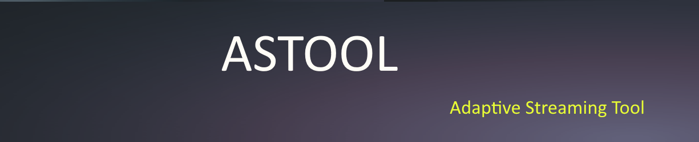

# What is ASTOOL?
Adaptive Streaming Tool is an application supporting several features related to Adaptive Streaming. The first version is specifically dedicated to Smooth Streaming.
For instance, with ASTool version 1.0 you can
- Push a Smooth Streaming towards a Live Smooth  Streaming Ingestion Point in order to emulate a Live TV channel,
- Pull a Smooth Streaming asset (Live or VOD) from an existing service towards ismv and isma file on the local disk,
- Pull and Push a Live Smooth Streaming channel towards another Live Smooth Streaming Ingestion Point
- Parse isma and ismv files

As ASTool is based on .Net Core, the application can be installed on any operating system supporting .Net Core (Windows, Mac OS, Ubuntu, Debian, Centos, Red Hat).

The latest releases are available [here](https://github.com/flecoqui/ASTool/tree/master/Releases)

- [Windows latest release](https://github.com/flecoqui/ASTool/raw/master/Releases/LatestRelease.win.zip) 

    [win-download]:                 https://github.com/flecoqui/ASTool/raw/master/Releases/LatestRelease.win.zip
    [astool-version-badge]:            https://cdn.rawgit.com/flecoqui/ASTool/master/Docs/latest_build_1.0.0.0.svg
    [![Github Release][astool-version-badge]][win-download]

- [Ubuntu  latest release](https://github.com/flecoqui/ASTool/raw/master/Releases/LatestRelease.ubuntu.tar.gz)

    [ubuntu-download]:                 https://github.com/flecoqui/ASTool/raw/master/Releases/LatestRelease.ubuntu.tar.gz
    [astool-version-badge]:            https://cdn.rawgit.com/flecoqui/ASTool/master/Docs/latest_build_1.0.0.0.svg
    [![Github Release][astool-version-badge]][ubuntu-download]

- [Debian latest release](https://github.com/flecoqui/ASTool/raw/master/Releases/LatestRelease.debian.tar.gz)

    [debian-download]:                 https://github.com/flecoqui/ASTool/raw/master/Releases/LatestRelease.debian.tar.gz
    [astool-version-badge]:            https://cdn.rawgit.com/flecoqui/ASTool/master/Docs/latest_build_1.0.0.0.svg
    [![Github Release][astool-version-badge]][debian-download]

- [Centos latest release](https://github.com/flecoqui/ASTool/raw/master/Releases/LatestRelease.centos.tar.gz)

    [centos-download]:                 https://github.com/flecoqui/ASTool/raw/master/Releases/LatestRelease.centos.tar.gz
    [astool-version-badge]:            https://cdn.rawgit.com/flecoqui/ASTool/master/Docs/latest_build_1.0.0.0.svg
    [![Github Release][astool-version-badge]][centos-download]

- [Red Hat latest release](https://github.com/flecoqui/ASTool/raw/master/Releases/LatestRelease.rhel.tar.gz)

    [rhel-download]:                 https://github.com/flecoqui/ASTool/raw/master/Releases/LatestRelease.rhel.tar.gz
    [astool-version-badge]:            https://cdn.rawgit.com/flecoqui/ASTool/master/Docs/latest_build_1.0.0.0.svg
    [![Github Release][astool-version-badge]][rhel-download]

- [Mac OS latest release](https://github.com/flecoqui/ASTool/raw/master/Releases/LatestRelease.osx.tar.gz)

    [osx-download]:                 https://github.com/flecoqui/ASTool/raw/master/Releases/LatestRelease.osx.tar.gz
    [astool-version-badge]:            https://cdn.rawgit.com/flecoqui/ASTool/master/Docs/latest_build_1.0.0.0.svg
    [![Github Release][astool-version-badge]][osx-download]

# Required Software
|[Windows pre-requisites](https://docs.microsoft.com/en-us/dotnet/core/windows-prerequisites?tabs=netcore2x)| [Linux pre-requisites](https://docs.microsoft.com/en-us/dotnet/core/linux-prerequisites?tabs=netcore2x)|  [Mac OS pre-requisites](https://docs.microsoft.com/en-us/dotnet/core/macos-prerequisites?tabs=netcore2x)|
| :--- | :--- | :--- |
| .NET Core is supported on the following versions of Windows 7 SP1, Windows 8.1, Windows 10 (version 1607) or later versions, Windows Server 2008 R2 SP1, Windows Server 2012 SP1, Windows Server 2012 R2, Windows Server 2016 or later versions | The Linux pre-requisites depends on the Linux distribution. Click on the link above to get further information &nbsp; &nbsp; &nbsp; &nbsp; &nbsp; &nbsp; &nbsp; &nbsp; &nbsp; &nbsp; &nbsp;&nbsp; &nbsp; &nbsp; &nbsp; &nbsp; &nbsp; &nbsp; &nbsp; &nbsp; &nbsp; &nbsp;&nbsp; &nbsp; &nbsp; &nbsp; &nbsp; &nbsp; &nbsp; &nbsp; &nbsp; &nbsp; &nbsp;&nbsp; &nbsp; &nbsp; &nbsp; &nbsp; &nbsp; &nbsp; &nbsp; &nbsp; &nbsp; &nbsp;&nbsp; &nbsp; &nbsp; &nbsp; &nbsp; &nbsp; &nbsp; &nbsp; &nbsp; &nbsp; &nbsp; &nbsp; &nbsp; &nbsp; &nbsp;&nbsp; &nbsp; &nbsp; &nbsp; &nbsp; &nbsp; &nbsp; &nbsp; &nbsp;&nbsp; &nbsp; &nbsp; &nbsp; &nbsp; &nbsp;&nbsp; &nbsp; &nbsp; &nbsp; &nbsp; &nbsp; &nbsp; &nbsp; &nbsp;&nbsp; &nbsp; &nbsp; &nbsp; &nbsp; &nbsp;&nbsp; &nbsp; &nbsp; &nbsp; &nbsp; &nbsp; &nbsp; &nbsp; &nbsp;| .NET Core 2.x is supported on the following versions of macOS macOS 10.12 "Sierra" and later versions &nbsp; &nbsp; &nbsp; &nbsp; &nbsp; &nbsp; &nbsp; &nbsp; &nbsp; &nbsp; &nbsp;&nbsp; &nbsp; &nbsp; &nbsp; &nbsp; &nbsp; &nbsp; &nbsp; &nbsp; &nbsp; &nbsp;&nbsp; &nbsp; &nbsp; &nbsp; &nbsp; &nbsp; &nbsp; &nbsp; &nbsp; &nbsp; &nbsp;&nbsp; &nbsp; &nbsp; &nbsp; &nbsp; &nbsp; &nbsp; &nbsp; &nbsp; &nbsp; &nbsp;&nbsp; &nbsp; &nbsp; &nbsp; &nbsp; &nbsp; &nbsp; &nbsp; &nbsp; &nbsp; &nbsp;&nbsp; &nbsp; &nbsp; &nbsp; &nbsp; &nbsp; &nbsp; &nbsp; &nbsp; &nbsp; &nbsp;&nbsp; &nbsp;&nbsp; &nbsp; &nbsp; &nbsp; &nbsp; &nbsp;&nbsp; &nbsp; &nbsp; &nbsp; &nbsp; &nbsp; &nbsp; &nbsp; &nbsp;&nbsp; &nbsp; &nbsp; &nbsp; &nbsp; &nbsp;&nbsp; &nbsp; &nbsp; &nbsp; &nbsp; &nbsp; &nbsp; &nbsp; &nbsp;|

# Features area

The Adaptive Streaming Tool (ASTool) is an Open Source command line tool supporting several features. This chapter describes how to launch a feature from a command line.

##  Push feature: 
This feature pushes a Smooth Streaming VOD asset towards Live ingestion point to emulate a Live Channel based on VOD Asset. The Live ingestion point can be either an IIS Media Services or an Azure Media Services ingestion point.

### Syntax

    ASTool --push     --input <inputLocalISMFile> --output <outputLiveUri>
            [--minbitrate <bitrate b/s>  --maxbitrate <bitrate b/s> --loop <loopCounter>]
            [--name <service name> --counterperiod <periodinseconds>]
            [--tracefile <path> --tracesize <size in bytes> ]
            [--tracelevel <none|information|error|warning|verbose>]
            [--consolelevel <none|information|error|warning|verbose>]

| option | value type | default value | Description | 
| :--- | :--- | :--- |  :--- | 
|--input| string | null | Path to the local ISM file on the disk (mandatory option)|
|--ouput| string | null | Uri of the ingestion point (mandatory option)|
|--loop| int |0  | number of live loop when the value is 0, infinite loop|
|--minbitrate| int |0  | minimum bitrate of the video tracks to select|
|--maxbitrate| int |0  | maximum bitrate of the video tracks to select. When the value is 0, all the video tracks with a bitrate over minbitrate value are selected |
|--name| string | null  | name of the service, only used for the logs |
|--counterperiod &nbsp; &nbsp; &nbsp; &nbsp;&nbsp; &nbsp; &nbsp; &nbsp;&nbsp; &nbsp; &nbsp; &nbsp;&nbsp; &nbsp; &nbsp; &nbsp;| int |0  | period in seconds used to display the counters|
|--tracefile| string | null  | path of the file where the trace will be stored |
|--tracesize| int |0  | maximum size of the trace file|
|--tracelevel| string | null  | trace level: none (no log in the trace file), information, error, warning, verbose |
|--consolelevel| string | null  | console level: none (no log in the console), information, error, warning, verbose |

### Examples

Push a smooth streaming asset (C:\projects\VideoApp\metisser\metisser.ism) towards a local IIS Media Services ingestion point (http://localhost/VideoApp/Live/_live1.isml):

    ASTool.exe --push --input C:\projects\VideoApp\metisser\metisser.ism --output http://localhost/VideoApp/Live/_live1.isml --loop 0

The live stream can be played opening the url: http://localhost/VideoApp/Live/_live1.isml/manifest

Same exemple with Azure Media Services:

    ASTool.exe --push --input C:\projects\VideoApp\metisser\metisser.ism --output http://testsmoothlive-testamsmedia.channel.mediaservices.windows.net/ingest.isml --loop 0

The live stream can be played opening the url: http://testsmoothlive-testamsmedia.channel.mediaservices.windows.net/preview.isml/manifest

##  Pull feature: 
Create VOD asset from an existing Smooth Streaming VOD asset or a Live Smooth Streaming channel already online.

### Syntax

    ASTool --pull     --input <inputVODUri> --output <outputLocalDirectory>
            [--minbitrate <bitrate b/s>  --maxbitrate <bitrate b/s>]
            [--maxduration <duration ms>]
            [--audiotrackname <name>  --texttrackname <name>]
            [--liveoffset <value in seconds>]
            [--name <service name> --counterperiod <periodinseconds>]
            [--tracefile <path> --tracesize <size in bytes> ]
            [--tracelevel <none|information|error|warning|verbose>]
            [--consolelevel <none|information|error|warning|verbose>]

| option | value type | default value | Description | 
| :--- | :--- | :--- |  :--- | 
|--input| string | null | Uri of the VOD stream or Live stream|
|--ouput| string | null | Path of the folder where the audio and video chunks will be stored|
|--minbitrate| int |0  | minimum bitrate of the video tracks to select|
|--maxbitrate| int |0  | maximum bitrate of the video tracks to select. When the value is 0, all the video tracks with a bitrate over minbitrate value are selected |
|--maxduration| int |0  | maximum duration of the capture in milliseconds |
|--audiotrackname&nbsp; &nbsp;&nbsp; &nbsp; &nbsp; &nbsp;&nbsp; &nbsp; &nbsp; &nbsp;&nbsp; &nbsp; &nbsp; &nbsp;&nbsp; &nbsp;&nbsp;| string |null  | name of the audio track to capture, if this value is not set all the audio tracks are captured|
|--texttrackname| string |null  | name of the text track to capture, if this value is not set all the text tracks are captured|
|--liveoffset| int | 0  | the offset in seconds with the live position. If this value is not set, ASTool will start to capture the audio and video chunk at the beginning of the Live buffer defined in the smooth Streaming manifest|
|--name| string | null  | name of the service, used for the traces |
|--counterperiod| int |0  | period in seconds used to display the counters|
|--tracefile| string | null  | path of the file where the trace will be stored |
|--tracesize| int |0  | maximum size of the trace file|
|--tracelevel| string | null  | trace level: none (no log in the trace file), information, error, warning, verbose |
|--consolelevel| string | null  | console level: none (no log in the console), information, error, warning, verbose |

### Examples

Pull a smooth streaming VOD asset (http://localhost/VideoApp/metisser/metisser.ism/manifest) towards a folder on a local disk (C:\astool\testvod):

    ASTool.exe --pull --input http://localhost/VideoApp/metisser/metisser.ism/manifest --output C:\astool\testvod
    
The isma and ismv files are available under C:\astool\testvod\metisser folder and can be played with tool like VLC.

Same exemple with Live Stream:

Pull a smooth streaming Live stream  (http://b028.wpc.azureedge.net/80B028/Samples/a38e6323-95e9-4f1f-9b38-75eba91704e4/5f2ce531-d508-49fb-8152-647eba422aec.ism/manifest) towards a folder on a local disk (C:\astool\testvod) during 60 seconds:

    ASTool.exe --pull --input http://b028.wpc.azureedge.net/80B028/Samples/a38e6323-95e9-4f1f-9b38-75eba91704e4/5f2ce531-d508-49fb-8152-647eba422aec.ism/manifest  --output C:\astool\testdvr --maxduration 60000 

The isma and ismv files are available under C:\astool\testdvr\a38e6323-95e9-4f1f-9b38-75eba91704e4/5f2ce531-d508-49fb-8152-647eba422aec folder and can be played with tool like VLC.

##  PullPush feature: 
Route an existing Live Stream towards an Azure Media Service Live ingestion point or an IIS Media Service ingestion point.

### Syntax

    ASTool --pullpush     --input <inputLiveUri> --output <outputLiveUri>
            [--minbitrate <bitrate b/s>  --maxbitrate <bitrate b/s>]
            [--maxduration <duration ms>]
            [--audiotrackname <name>  --texttrackname <name>]
            [--liveoffset <value in seconds>]
            [--name <service name> --counterperiod <periodinseconds>]
            [--tracefile <path> --tracesize <size in bytes> ]
            [--tracelevel <none|information|error|warning|verbose>]
            [--consolelevel <none|information|error|warning|verbose>]

| option | value type | default value | Description | 
| :--- | :--- | :--- |  :--- | 
|--input| string | null | Uri of the Live stream |
|--ouput| string | null | Uri of the output Live stream ingestion point |
|--minbitrate| int |0  | minimum bitrate of the video tracks to select|
|--maxbitrate| int |0  | maximum bitrate of the video tracks to select. When the value is 0, all the video tracks with a bitrate over minbitrate value are selected |
|--maxduration| int |0  | maximum duration of the capture in milliseconds |
|--audiotrackname&nbsp; &nbsp;&nbsp; &nbsp; &nbsp; &nbsp;&nbsp; &nbsp; &nbsp; &nbsp;&nbsp; &nbsp; &nbsp; &nbsp;&nbsp; &nbsp;&nbsp;&nbsp;&nbsp;&nbsp;&nbsp;&nbsp;&nbsp;&nbsp;&nbsp;&nbsp;&nbsp;&nbsp;&nbsp;&nbsp;&nbsp;&nbsp;&nbsp; &nbsp;&nbsp;&nbsp;&nbsp;&nbsp;&nbsp;| string |null  | name of the audio track to capture, if this value is not set all the audio tracks are captured|
|--texttrackname| string |null  | name of the text track to capture, if this value is not set all the text tracks are captured|
|--liveoffset| int | 0  | the offset in seconds with the live position. If this value is not set, ASTool will start to capture the audio and video chunk at the beginning of the Live buffer defined in the smooth Streaming manifest|
|--name| string | null  | name of the service, used for the traces |
|--counterperiod| int |0  | period in seconds used to display the counters|
|--tracefile| string | null  | path of the file where the trace will be stored |
|--tracesize| int |0  | maximum size of the trace file|
|--tracelevel| string | null  | trace level: none (no log in the trace file), information, error, warning, verbose |
|--consolelevel| string | null  | console level: none (no log in the console), information, error, warning, verbose |

### Examples

Pull and Push a Live smooth streaming asset from  (http://b028.wpc.azureedge.net/80B028/Samples/a38e6323-95e9-4f1f-9b38-75eba91704e4/5f2ce531-d508-49fb-8152-647eba422aec.ism/manifest) towards a local IIS Media Services Ingestion point (http://localhost/VideoApp/Live/_live1.isml), only the video tracks with a bitrate between 300kbps and 1Mpbs are routed:

    ASTool.exe --pullpush --input http://b028.wpc.azureedge.net/80B028/Samples/a38e6323-95e9-4f1f-9b38-75eba91704e4/5f2ce531-d508-49fb-8152-647eba422aec.ism/manifest --minbitrate 300000   --maxbitrate 1000000  --output http://localhost/VideoApp/Live/_live1.isml
    
The live stream can be played opening the url: http://localhost/VideoApp/Live/_live1.isml/manifest 

Same exemple with Azure Media Services:

    ASTool.exe --pullpush --input http://b028.wpc.azureedge.net/80B028/Samples/a38e6323-95e9-4f1f-9b38-75eba91704e4/5f2ce531-d508-49fb-8152-647eba422aec.ism/manifest --minbitrate 300000   --maxbitrate 1000000  --output http://testsmoothlive-testamsmedia.channel.mediaservices.windows.net/ingest.isml  

The live stream can be played opening the url: http://testsmoothlive-testamsmedia.channel.mediaservices.windows.net/preview.isml/manifest

## Running several features simultaneously: 
With ASTool it's possible with a single command line to instantiate several features simultaneously. In that case, the features are defined in an XML config file.
For instance a [Windows Configuration File](https://raw.githubusercontent.com/flecoqui/ASTool/master/Azure/101-vm-astool-release-universal/astool.windows.xml) a  [Linux Configuration File](https://raw.githubusercontent.com/flecoqui/ASTool/master/Azure/101-vm-astool-release-universal/astool.linux.xml)

Below the content of such file:

    <ArrayOfOptions xmlns="http://schemas.datacontract.org/2004/07/ASTool" xmlns:i="http://www.w3.org/2001/XMLSchema-instance">
    <Options>
        <ASToolAction>Pull</ASToolAction>
        <AudioTrackName/>
        <BufferSize>1000000</BufferSize>
        <ConfigFile/>
        <ConsoleLevel>Information</ConsoleLevel>
        <CounterPeriod>300</CounterPeriod>
        <InputUri>http://b028.wpc.azureedge.net/80B028/Samples/a38e6323-95e9-4f1f-9b38-75eba91704e4/5f2ce531-d508-49fb-8152-647eba422aec.ism/manifest</InputUri>
        <LiveOffset>10</LiveOffset>
        <Loop>0</Loop>
        <MaxBitrate>10000000</MaxBitrate>
        <MaxDuration>3600000</MaxDuration>
        <MinBitrate>100000</MinBitrate>
        <Name>PullService1</Name>
        <OutputUri>/astool/dvr/test1</OutputUri>
        <TextTrackName/>
        <TraceFile>/astool/log/TracePullService1.log</TraceFile>
        <TraceLevel>Information</TraceLevel>
        <TraceSize>524280</TraceSize>
    </Options>
    <Options>
        <ASToolAction>Pull</ASToolAction>
        <AudioTrackName/>
        <BufferSize>1000000</BufferSize>
        <ConfigFile/>
        <ConsoleLevel>Information</ConsoleLevel>
        <CounterPeriod>300</CounterPeriod>
        <InputUri>http://b028.wpc.azureedge.net/80B028/Samples/a38e6323-95e9-4f1f-9b38-75eba91704e4/5f2ce531-d508-49fb-8152-647eba422aec.ism/manifest</InputUri>
        <LiveOffset>0</LiveOffset>
        <Loop>0</Loop>
        <MaxBitrate>10000000</MaxBitrate>
        <MaxDuration>3600000</MaxDuration>
        <MinBitrate>100000</MinBitrate>
        <Name>PullService2</Name>
        <OutputUri>/astool/dvr/test2</OutputUri>
        <TextTrackName/>
        <TraceFile>/astool/log/TracePullService2.log</TraceFile>
        <TraceLevel>Information</TraceLevel>
        <TraceSize>524280</TraceSize>
    </Options>
    </ArrayOfOptions>

### Syntax

Launching ASTool to run several features defined in the XML configuration file.

    ASTool --import --configfile  <configFile>

| option | value type | default value | Description | 
| :--- | :--- | :--- |  :--- | 
|--configfile&nbsp;&nbsp; &nbsp; &nbsp; &nbsp;| string | null | Path to the XML config File which contains the information about the features to instantiate|

Exporting an XML configuration file which could be updated afterwards.

    ASTool --export --configfile  <configFile>

| option | value type | default value | Description | 
| :--- | :--- | :--- |  :--- | 
|--configfile&nbsp;&nbsp; &nbsp; &nbsp; &nbsp;| string | null | Path to the XML config File which will be created containing sample push, pull, pullpush feature|

### Examples

Launching the features defined in the configfile:

    ASTool.exe --import --configfile C:\astool\config\astool.windows.xml

##  Parse feature: 
Parsing isma and ismv files

### Syntax

    ASTool --parse    --input <inputLocalISMXFile> 
            [--tracefile <path> --tracesize <size in bytes> ]
            [--tracelevel <none|information|error|warning|verbose>]
            [--consolelevel <none|information|error|warning|verbose>]

| option | value type | default value | Description | 
| :--- | :--- | :--- |  :--- | 
|--input| string | null | Path to the local ISMV or ISMA file on the disk|
|--tracefile| string | null  | path of the file where the trace will be stored |
|--tracesize| int |0  | maximum size of the trace file|
|--tracelevel| string | null  | trace level: none (no log in the trace file), information, error, warning, verbose |
|--consolelevel&nbsp;  &nbsp; &nbsp;&nbsp; | string | null  | console level: none (no log in the console), information, error, warning, verbose |

### Examples

Parsing an ISMA file and displaying the MP4 boxes hierarchy:

    ASTool.exe --parse --input C:\ASTool\testdvr\5f2ce531-d508-49fb-8152-647eba422aec\Audio_0.isma

Parsing an ISMV file, displaying the MP4 boxes hierarchy and the content of each box in hexadecimal:

    ASTool.exe --parse --input C:\ASTool\testdvr\5f2ce531-d508-49fb-8152-647eba422aec\Video_0.ismv --consolelevel verbose

##  Service feature (Windows Platform only): 
Install, start, stop and uninstall ASTool as Windows Service. This feature is only available on Windows. For Linux, the [installation script](https://github.com/flecoqui/ASTool/blob/master/Azure/101-vm-astool-release-universal/install-software.sh) automatically install ASTool as a service. 

### Syntax

Installing the Windows Service

    ASTool --install --configfile  <configFile>

| option | value type | default value | Description | 
| :--- | :--- | :--- |  :--- | 
|--configfile| string | null | Path to the XML config File|

Uninstalling the Windows Service

    ASTool --uninstall

Starting the Windows Service

    ASTool --start

Stopping the Windows Service

    ASTool --stop

### Examples

Installing the service on Windows:

    ASTool.exe --install --configfile C:\astool\config\astool.windows.xml

# Building ASTOOL
If you want to build ASTOOL on your machine, you need first to install all the pre-requisites to run .Net Core on your machine, check in the table below based on your current Operating System:

## Pre-requisites

|[Windows pre-requisites](https://docs.microsoft.com/en-us/dotnet/core/windows-prerequisites?tabs=netcore2x)| [Linux pre-requisites](https://docs.microsoft.com/en-us/dotnet/core/linux-prerequisites?tabs=netcore2x)|  [Mac OS pre-requisites](https://docs.microsoft.com/en-us/dotnet/core/macos-prerequisites?tabs=netcore2x)|
| :--- | :--- | :--- |
| .NET Core is supported on the following versions of Windows 7 SP1, Windows 8.1, Windows 10 (version 1607) or later versions, Windows Server 2008 R2 SP1, Windows Server 2012 SP1, Windows Server 2012 R2, Windows Server 2016 or later versions | The Linux pre-requisites depends on the Linux distribution. Click on the link above to get further information &nbsp; &nbsp; &nbsp; &nbsp; &nbsp; &nbsp; &nbsp; &nbsp; &nbsp; &nbsp; &nbsp;&nbsp; &nbsp; &nbsp; &nbsp; &nbsp; &nbsp; &nbsp; &nbsp; &nbsp; &nbsp; &nbsp;&nbsp; &nbsp; &nbsp; &nbsp; &nbsp; &nbsp; &nbsp; &nbsp; &nbsp; &nbsp; &nbsp;&nbsp; &nbsp; &nbsp; &nbsp; &nbsp; &nbsp; &nbsp; &nbsp; &nbsp; &nbsp; &nbsp;&nbsp; &nbsp; &nbsp; &nbsp; &nbsp; &nbsp; &nbsp; &nbsp; &nbsp; &nbsp; &nbsp; &nbsp; &nbsp; &nbsp; &nbsp;&nbsp; &nbsp; &nbsp; &nbsp; &nbsp; &nbsp; &nbsp; &nbsp; &nbsp;&nbsp; &nbsp; &nbsp; &nbsp; &nbsp; &nbsp;&nbsp; &nbsp; &nbsp; &nbsp; &nbsp; &nbsp; &nbsp; &nbsp; &nbsp;&nbsp; &nbsp; &nbsp; &nbsp; &nbsp; &nbsp;&nbsp; &nbsp; &nbsp; &nbsp; &nbsp; &nbsp; &nbsp; &nbsp; &nbsp;| .NET Core 2.x is supported on the following versions of macOS macOS 10.12 "Sierra" and later versions &nbsp; &nbsp; &nbsp; &nbsp; &nbsp; &nbsp; &nbsp; &nbsp; &nbsp; &nbsp; &nbsp;&nbsp; &nbsp; &nbsp; &nbsp; &nbsp; &nbsp; &nbsp; &nbsp; &nbsp; &nbsp; &nbsp;&nbsp; &nbsp; &nbsp; &nbsp; &nbsp; &nbsp; &nbsp; &nbsp; &nbsp; &nbsp; &nbsp;&nbsp; &nbsp; &nbsp; &nbsp; &nbsp; &nbsp; &nbsp; &nbsp; &nbsp; &nbsp; &nbsp;&nbsp; &nbsp; &nbsp; &nbsp; &nbsp; &nbsp; &nbsp; &nbsp; &nbsp; &nbsp; &nbsp;&nbsp; &nbsp; &nbsp; &nbsp; &nbsp; &nbsp; &nbsp; &nbsp; &nbsp; &nbsp; &nbsp;&nbsp; &nbsp;&nbsp; &nbsp; &nbsp; &nbsp; &nbsp; &nbsp;&nbsp; &nbsp; &nbsp; &nbsp; &nbsp; &nbsp; &nbsp; &nbsp; &nbsp;&nbsp; &nbsp; &nbsp; &nbsp; &nbsp; &nbsp;&nbsp; &nbsp; &nbsp; &nbsp; &nbsp; &nbsp; &nbsp; &nbsp; &nbsp;|

## Installing git and .Net Core SDK version 2.1

Once the pre-requisites are installed, you need to install:

- Git from https://github.com/
- .Net Core SDK version 2.1 or later from https://dot.net/
- Clone ASTool github repository on your machine
  For instance on a machine running linux:

        mkdir /git
        cd /git
        git clone https://github.com/flecoqui/ASTool.git
        cd ASTool/cs/ASTool/ASTool/

## Building the self-contained binaries

You are now ready to build ASTool binaries, as ASTool needs to be easy to install and doesn't require the installation before of .Net Core, you can build Self Contained binaries of ASTool which doesn't require the installation of .Net Core.

For instance you can run the following commands to build the different flavor of ASTool:

    cd /git/ASTool/cs/ASTool/ASTool/
    dotnet publish --self-contained -c Release -r win-x64
    dotnet publish --self-contained -c Release -r centos-x64
    dotnet publish --self-contained -c Release -r rhel-x64
    dotnet publish --self-contained -c Release -r ubuntu-x64
    dotnet publish --self-contained -c Release -r debian-x64
    dotnet publish --self-contained -c Release -r osx-x64

The Command lines above built the ASTool binaries for Windows, Centos, RedHat, Ubuntu, Debian and Mac OS.

When you run the following command:
    
    dotnet publish --self-contained -c Release -r [RuntimeFlavor]

the binaries will be available under:

    /git/ASTool/cs/ASTool/ASTool/bin/Release/netcoreapp2.0/[RuntimeFlavor]/publish

## Building the self-contained binaries on Azure

If you don't have a local machine to generate the binaries, you can use a virtual Machine running in Azure

This [Azure Resource Manager template](https://github.com/flecoqui/ASTool/tree/master/Azure/101-vm-astool-universal) allow you to deploy a virtual machine in Azure. You can select the operating system running on this virtual machine, it can be Windows Server 2016, Ubuntu, Debian, Centos or Redhat.
During the installation of the virtual machine, git and .Net Core SDK version 2.1 will be installed. 
Once all the pre-requsites are installed, the installation program will:

- clone ASTool github repository https://github.com/flecoqui/ASTool.git
- build the binary for the local platform (Windows or Linux)
- create a service to run automatically ASTool. By default this service will launch the Pull feature to capture the audio and video chunks of this sample Live asset: http://b028.wpc.azureedge.net/80B028/Samples/a38e6323-95e9-4f1f-9b38-75eba91704e4/5f2ce531-d508-49fb-8152-647eba422aec.ism/manifest during 3600 seconds.

The configuration files ([astool.linux.xml](https://raw.githubusercontent.com/flecoqui/ASTool/master/Azure/101-vm-astool-universal/astool.linux.xml) for Linux and [astool.windows.xml](https://raw.githubusercontent.com/flecoqui/ASTool/master/Azure/101-vm-astool-universal/astool.windows.xml) for Windows) will be stored under: /astool/config

This service will run simulatenously 2 captures, storing the audio and video chunks under /astool/dvr/test1 and /astool/dvr/test2.
The logs files will be available under /astool/log.

# Deploying ASTOOL in Azure

This template allows you to deploy a simple VM running: 

#### Debian: .Net Core and ASTOOL,
#### Ubuntu: .Net Core and ASTOOL, 
#### Centos: .Net Core and ASTOOL, 
#### Red Hat: .Net Core and ASTOOL,
#### Windows Server 2016: .Net Core and ASTOOL,
This will VM will be deployed in the region associated with Resource Group and the VM Size is one of the parameter.
With Azure CLI you can deploy this VM with 2 command lines:

## CREATE RESOURCE GROUP:
azure group create "ResourceGroupName" "DataCenterName"

For instance:

    azure group create astoolgrpeu2 eastus2

# Getting Started

https://docs.microsoft.com/en-us/dotnet/core/windows-prerequisites?tabs=netcore2x

https://docs.microsoft.com/en-us/dotnet/core/macos-prerequisites?tabs=netcore2x 

https://docs.microsoft.com/en-us/dotnet/core/linux-prerequisites?tabs=netcore2x

# Useful resources

